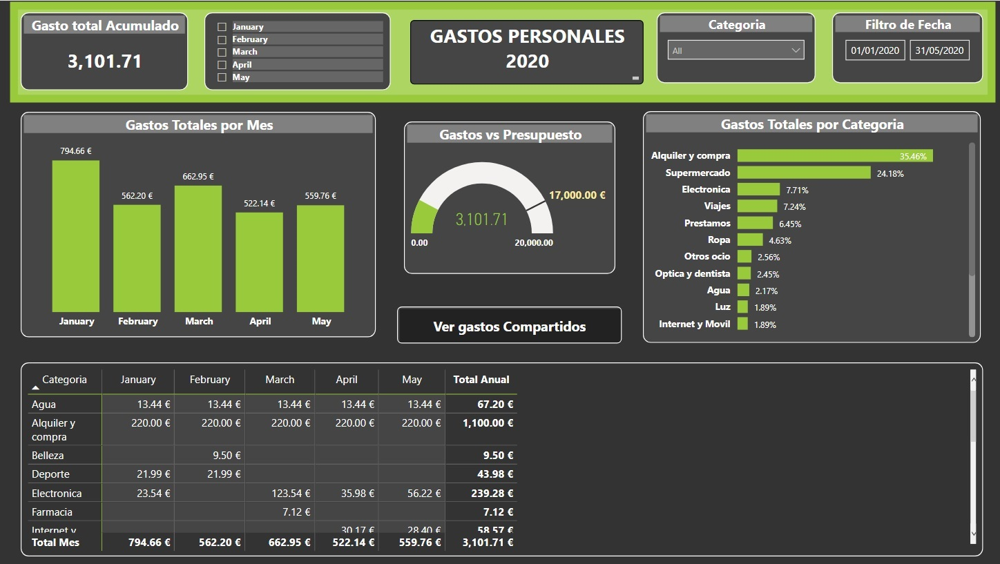
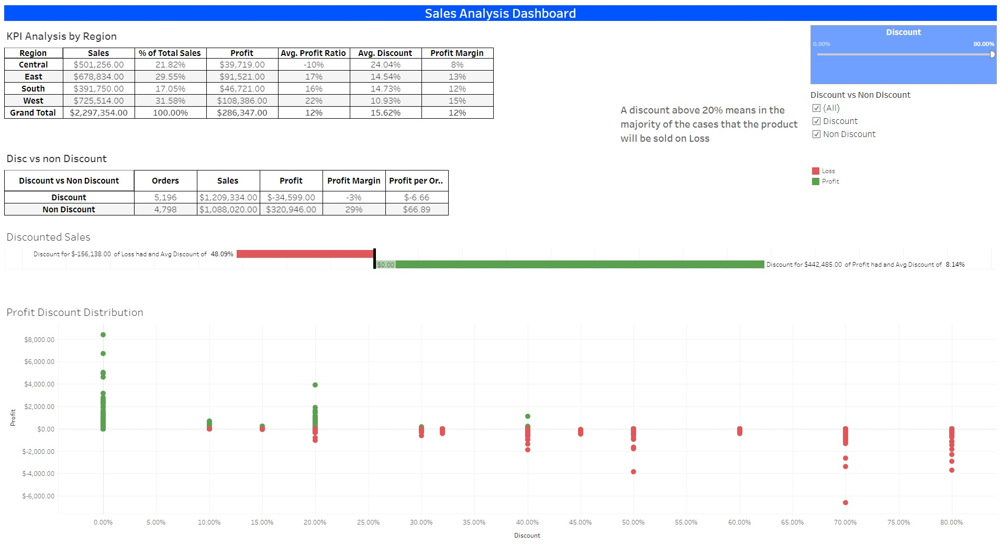

# **Gabriel Macuare**  

Welcome to my site :grinning:. I am an Analyst with +5 years of experience in pricing positions, reporting and data analysis. I am very passionate about new ways of automating manual tasks and improving processes in the enterprise. Throughout my career, I have been able to improve the decision-making processes by creating fabulous dashboards, reports and recommending clearly how can we overcome any challenge we might face in the market, based on data analysis.
  
 The main tools I have worked with are:
 
*  Python
*  Microsoft Power BI
*  Microsot Excel
*  Tableau
*  Business Objects
*  SQL

>You can connect with me on <a href="https://www.linkedin.com/in/gabrielmacuare/">  . Below you will find a snapshot of some things I have designed, please bear in mind that I have used **fictitious** data for the reports shown below.

## Python Automation
Through the use of Jupyter notebooks and Google colab I have been able to save precious time by: 
* Cleaning and preparing databases for loading.
* Automating reports loadings.

## Microsot Power BI
   

## Tableau 

## Microsoft Excel

        
